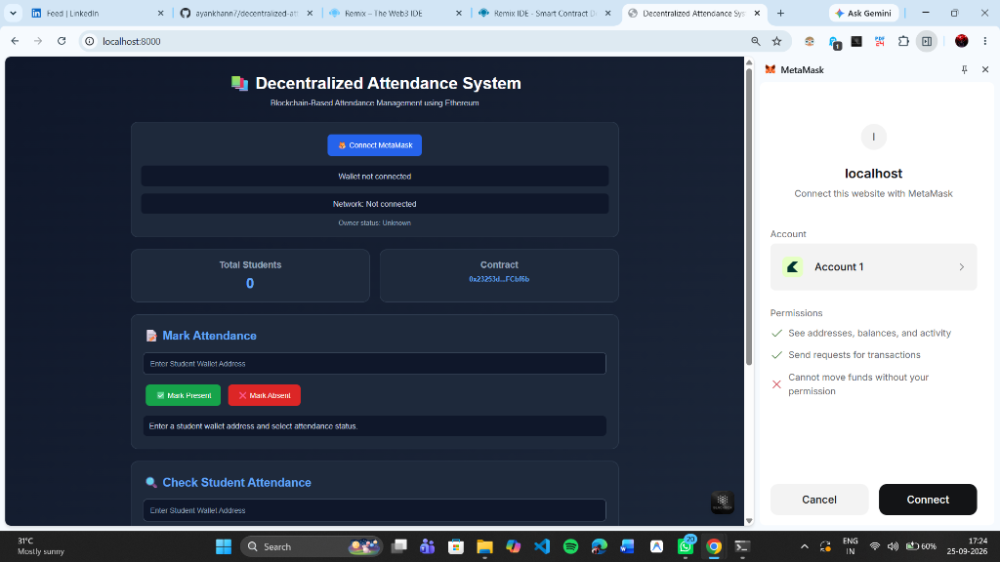
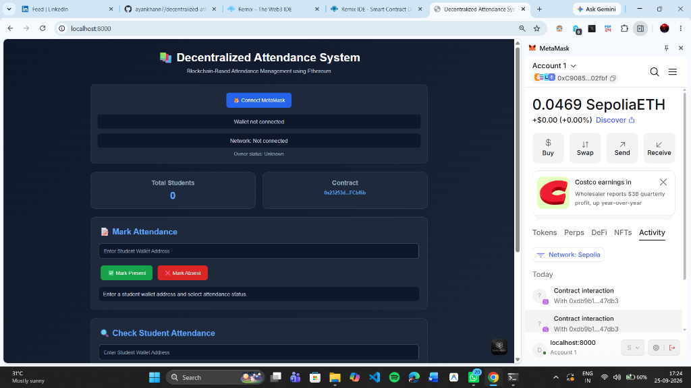
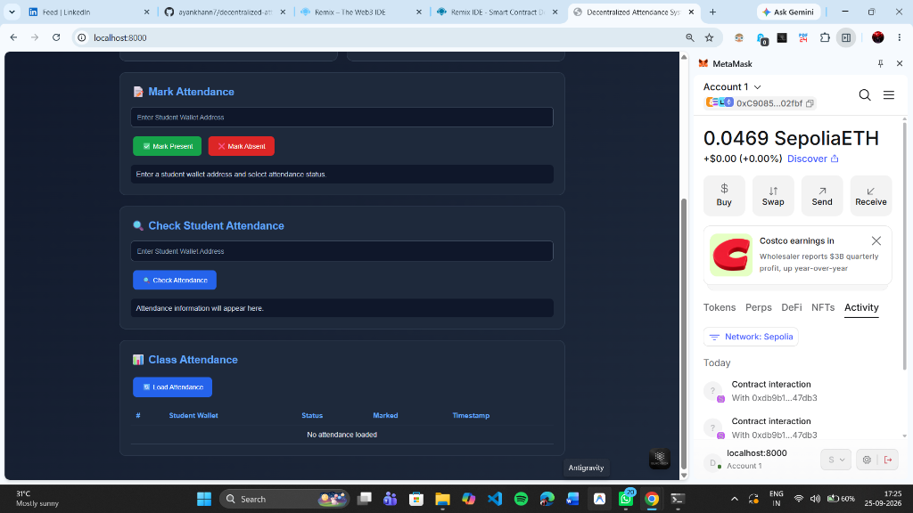
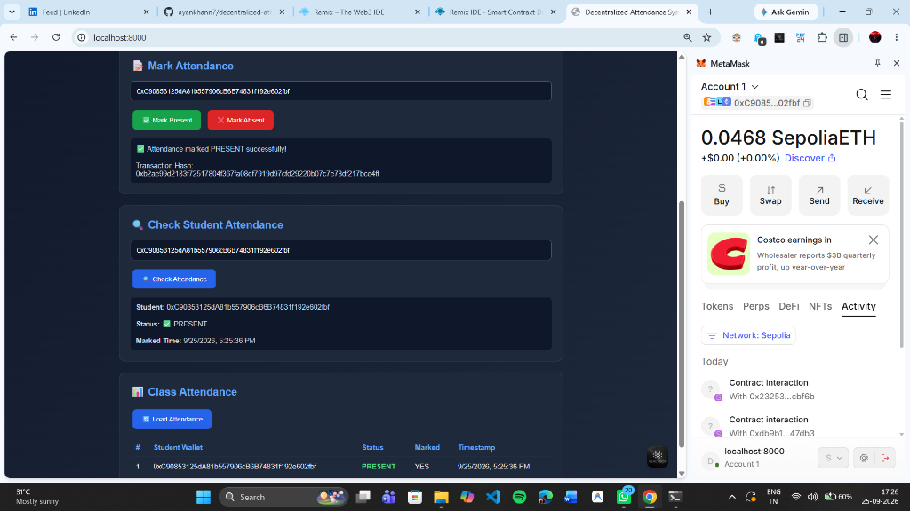
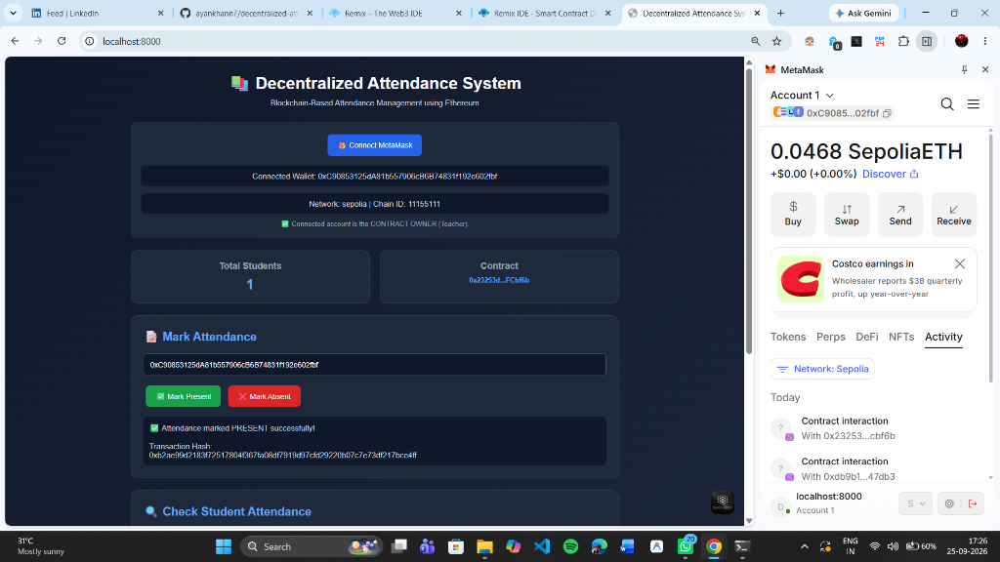
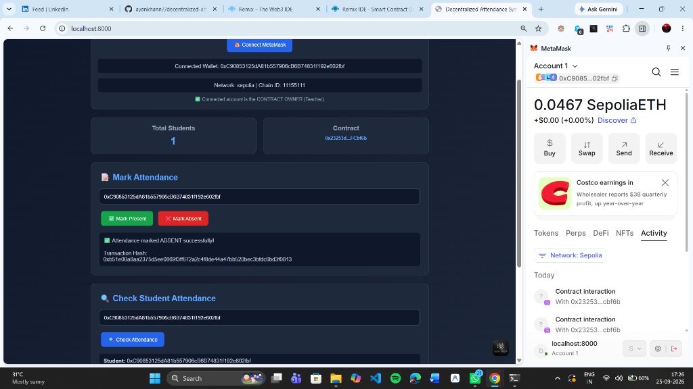
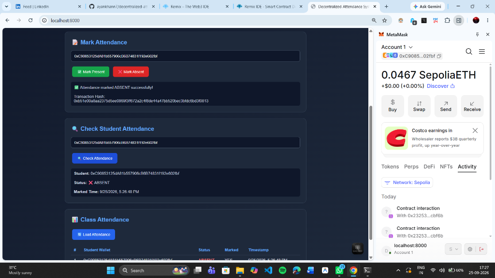
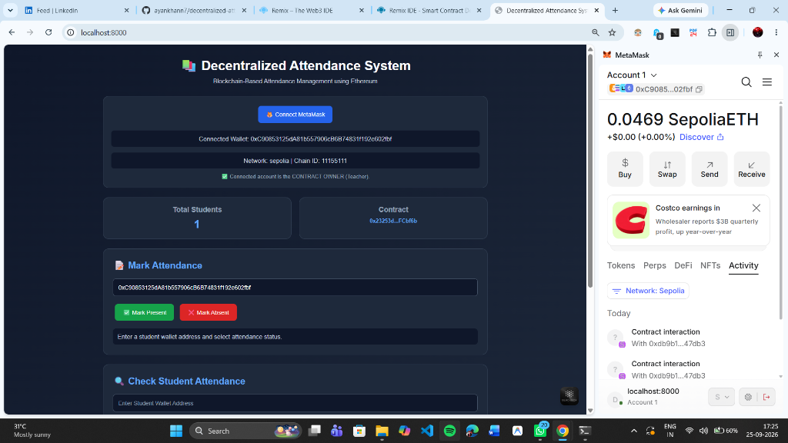

# Test Cases & Screenshots

### 1. Wallet Connection
Verify that the application successfully connects to the user's MetaMask wallet on the Sepolia network.

### 2. Owner Verification
Ensure only the contract owner can access restricted functions like marking attendance.

### 3. Mark Attendance (Present)
Test recording a student's attendance as PRESENT on the blockchain and generating a hash.

### 4. Check Student (Present)
Verify the system correctly retrieves and displays a PRESENT status for a specific address.

### 5. View Class Attendance
Check that the complete class attendance list is fetched accurately from the smart contract.

### 6. Mark Attendance (Absent)
Test recording a student's attendance as ABSENT on the blockchain and generating a hash.

### 7. Check Student (Absent)
Verify the system correctly retrieves and displays an ABSENT status for a specific address.

### 8. UI Overview
Overall view of the decentralized attendance portal layout and initial state.

